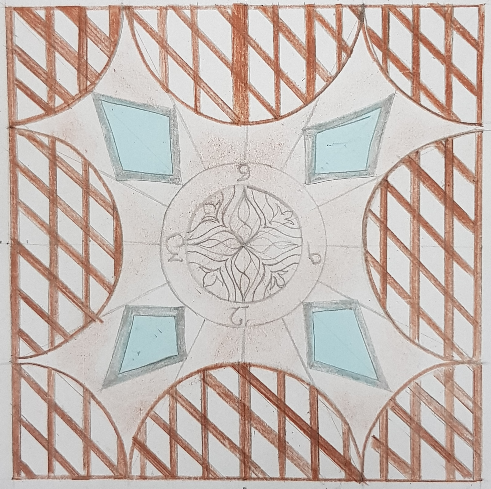
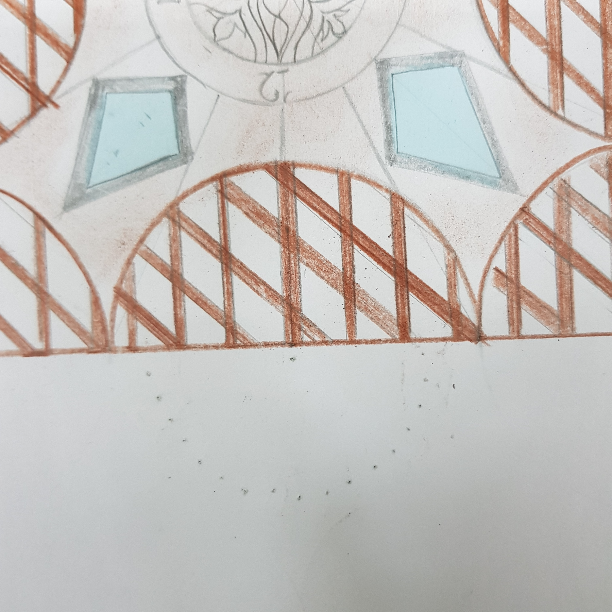
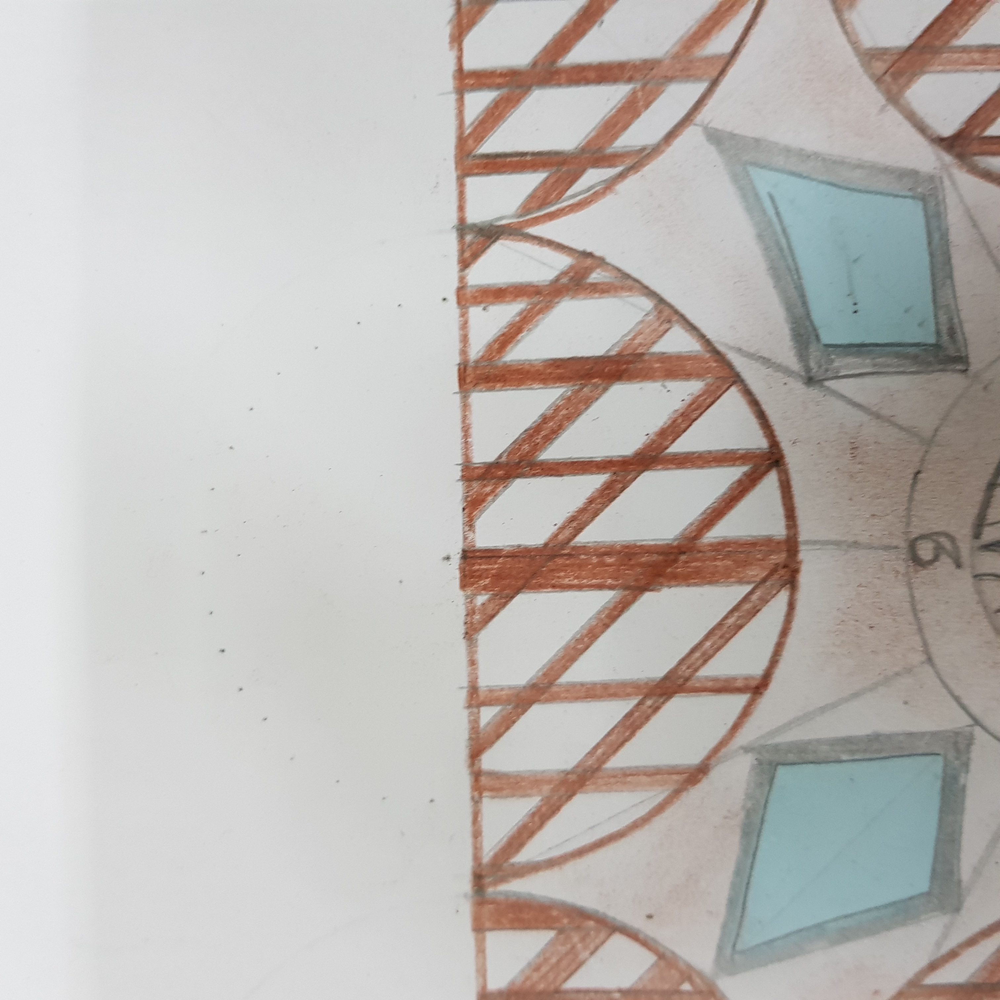
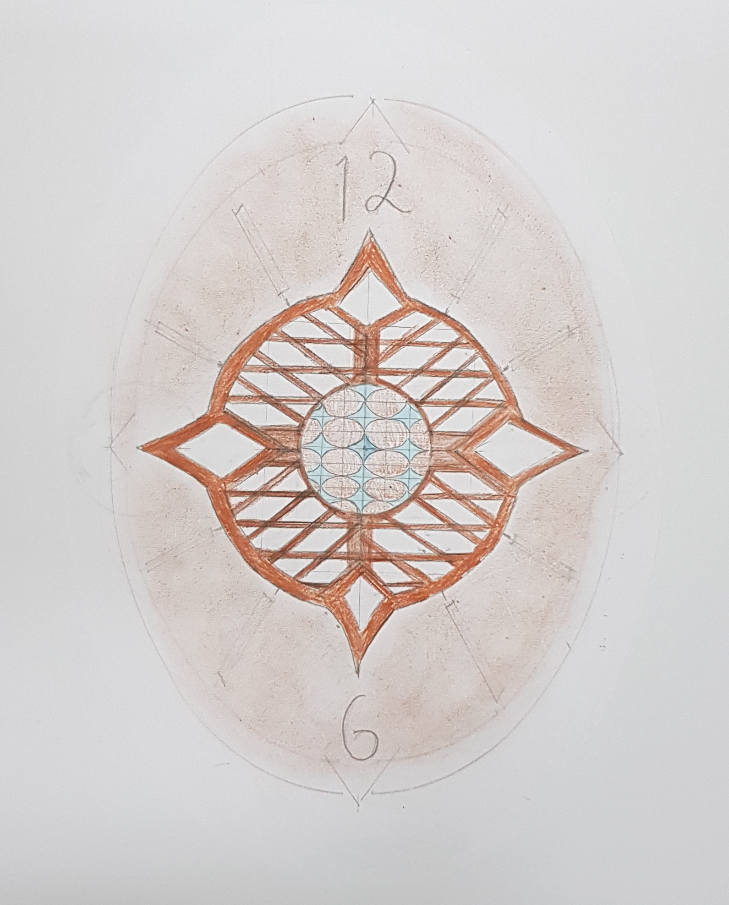

# Clock Design
## Goals
- [ ] explore variations of islamic design
- [ ] create a few designs of clock faces inspired by islamic design
- [ ] pick clock material
- [ ] build the clock face
- [ ] add the clock hands and implement the functional apsects

## exploration

## Design process

     

 

     

     

     

 

     

